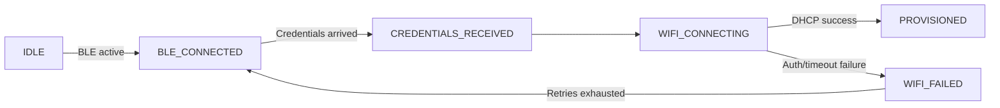

# KC-Device-ESP32-S3 – Detailed Overview

This document explains how the firmware provisions Wi-Fi using the ESP-IDF provisioning manager, how components interact, and how to operate or extend the system.

## 1. Provisioning Architecture

| Layer | File(s) | Responsibility |
|-------|---------|----------------|
| Provisioning manager wrapper | `main/idf_provisioning.c/.h` | Starts/stops ESP-IDF's Wi-Fi provisioning manager, selects BLE transport, enforces Security 1 + PoP, bridges callbacks into the local provisioning state machine, and kicks off `wifi_manager_connect()` once credentials arrive. |
| Provisioning state machine | `main/provisioning_state.c/.h` | Tracks transitions such as *BLE connected*, *credentials received*, *Wi-Fi connecting*, *provisioned*, or *failure*; notifies registered listeners (currently `main.c` logging). |
| Wi-Fi manager | `main/wifi_manager.c/.h` | Owns the station interface, saves credentials to NVS, retries connections, and exposes helpers to query connection state or clear credentials. |
| Reset button | `main/reset_button.c/.h` | Short press clears Wi-Fi credentials and restarts; long press performs a factory reset (NVS erase). |
| Cloud + services | `main/cloud_provisioning.c`, `http_server.c`, `mqtt_telemetry.c`, `sensor_manager.c`, etc. | Idle until Wi-Fi is online, then perform their usual duties (TLS provisioning, HTTPS dashboard, MQTT telemetry, sensor polling). |

### ESP-IDF Provisioning Manager Configuration

- **Transport**: BLE (`wifi_prov_scheme_ble`)
- **Security**: Security 1 (X25519 key exchange + PoP)
- **Proof-of-Possession**: `sumppop`
- **Service name**: `kc-<MAC[3..5]>` (e.g., `kc-12ABCD`)
- **Event handlers**: `WIFI_PROV_SCHEME_BLE_EVENT_HANDLER_FREE_BTDM` (frees BTDM after provisioning) and `WIFI_PROV_EVENT_HANDLER_NONE` for app-level callbacks.

### Flow

1. `main.c` boots, initializes security, the reset button, the provisioning state machine, and the Wi-Fi manager.
2. Stored Wi-Fi credentials (if any) are tested immediately. Success skips provisioning entirely.
3. On failure/no creds, `idf_provisioning_start()` starts the provisioning manager. BLE advertisements become visible in the ESP BLE Provisioning app.
4. User selects Security 1, enters the PoP `sumppop`, and supplies SSID/password.
5. ESP-IDF provisioning manager emits `WIFI_PROV_CRED_RECV`; the wrapper forwards credentials to `wifi_manager_connect()`.
6. When `wifi_manager` reports `IP_EVENT_STA_GOT_IP`, credentials are saved and provisioning stops (`idf_provisioning_stop()`), freeing BLE resources.
7. Cloud services start (`start_cloud_services()` in `main.c`).

## 2. Provisioning State Machine



- All transitions call `provisioning_state_set(state, status_code, message)`
- `main.c` registers `state_change_handler()` for logging/UI bridging
- State codes are shared with the mobile client documentation (see `docs/KOTLIN_INTEGRATION.md`)

## 3. Storage & Partitions

- `config/partitions.csv` defines two OTA slots sized at `0x1B0000` (≈1.73 MB) each, providing headroom for the current 1.66 MB binary
- FATFS (`www` partition backed by wear-levelling) starts at `0x380000` with a size of `0x080000`
- Wi-Fi credentials live in the `wifi_config` NVS namespace; they are cleared via the reset button or programmatically by `wifi_manager_clear_credentials()`

## 4. Operation Checklist

1. **Build / Flash / Monitor**
   ```powershell
   idf.py set-target esp32s3
   idf.py build flash monitor
   ```
2. **Provision**
   - Open the Espressif "ESP BLE Provisioning" mobile app
   - Scan for `kc-XXXXXX`
   - Choose *BLE*, *Security 1*, PoP `sumppop`
   - Enter Wi-Fi SSID/password and wait for "Provisioned" confirmation
3. **Clear Credentials**
   - Short press GPIO0 (BOOT) to erase Wi-Fi credentials and reboot into provisioning mode
   - Long press for full factory reset

## 5. Extending the System

- **Custom mobile client**: Follow `docs/KOTLIN_INTEGRATION.md` for implementing Security 1 provisioning in Android/Kotlin
- **Alternate PoP**: Update `kPop` in `main/idf_provisioning.c` and keep the secret synchronized with your provisioning UI
- **SoftAP provisioning**: The wrapper isolates BLE-specific pieces; swapping to `wifi_prov_scheme_softap` only requires updating the config struct and ensuring menuconfig enables SoftAP transport

## 6. Logs & Troubleshooting

- `idf_prov`: lifecycle of the provisioning manager wrapper (start/stop, service name, warnings)
- `wifi_prov_mgr`: lower-level provisioning manager logs (credential events, failures)
- `wifi_manager`: Wi-Fi connection attempts, retries, and NVS saves
- Common failure causes:
  - Wrong PoP → `WIFI_PROV_CRED_FAIL`
  - Bad password / missing SSID → `STATUS_ERROR_WIFI_AUTH_FAILED`
  - Provisioning skipped because stored creds succeeded → BLE not advertising; clear credentials first

## 7. Related Documents

- `KOTLIN_INTEGRATION.md` – App flow and Retrofit helpers for provisioning, retrieving state, etc.
- `PROJECT_STRUCTURE.md` – File-by-file explanation of the repo
- `SECURITY.md` – Secure boot, flash encryption, NVS encryption, PoP rotation tips
- `WEB_EDITOR_QUICKSTART.md` / `WEB_FILE_EDITOR.md` – HTTPS dashboard customization guides

This documentation intentionally omits the legacy custom GATT service; all provisioning functionality now routes through the ESP-IDF provisioning manager.
